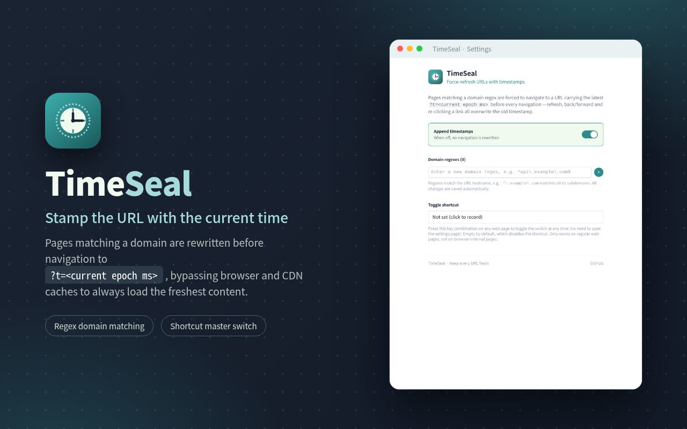
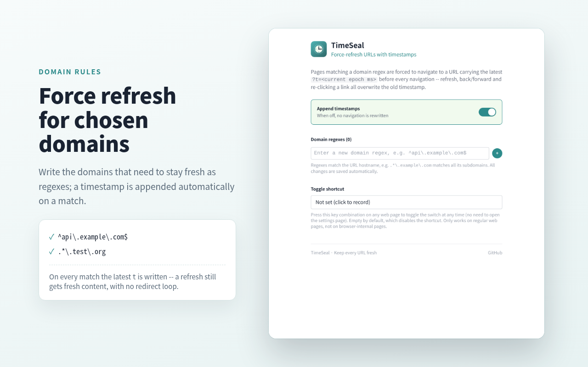
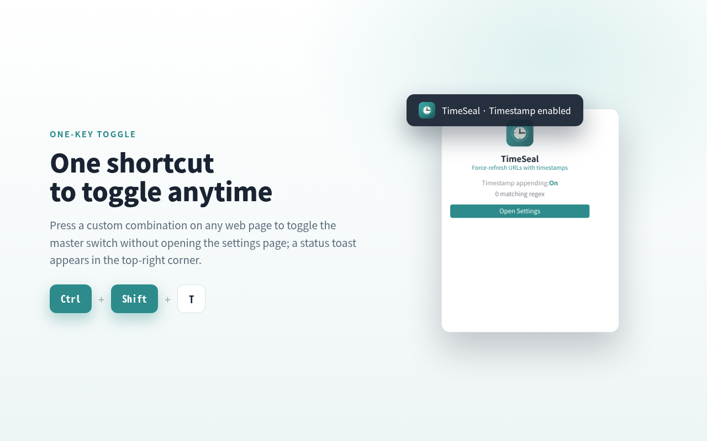

<div align="center">


# TimeSeal

**Stamp URLs with the current time and always load the freshest page.**

Pages on matching domains are rewritten before navigation to `?t=<current epoch ms>`,
bypassing browser and CDN caches so you always get the latest content.

[](#installation)
[](#installation)
[](./LICENSE)



</div>

## What problem does it solve

While developing, debugging, or running content operations, you often hit
"the page/API clearly updated, but the browser or CDN is still serving old content".
Manually appending `?t=123456` in the address bar is tedious, and the next navigation
gets cached again.

**TimeSeal** automates it: configure one regex for the domains that need to stay fresh,
and every navigation automatically appends the current timestamp, so caches expire naturally.

## Features

- ⏱ **Force timestamp appending before navigation** -- using `webNavigation.onBeforeNavigate`,
  the URL is rewritten to `?t=<epoch ms>` before the main frame navigates, so the cache is
  invalidated before the page even starts loading.
- 🎯 **Domain regex matching** -- match against the `hostname`, e.g. `.*\.example\.com`
  matches all subdomains; only the sites you choose are affected, other sites are untouched.
- 🔁 **Always fresh, no infinite loops** -- every navigation (refresh, back/forward, clicking a
  link again) overwrites the timestamp; a per-tab guard recognizes and lets through the
  extension's own rewrites, so there is no redirect loop.
- 🎚 **One-key master switch** -- toggle it from the popup/sidepanel, or record a global key
  combination (e.g. `Ctrl+Shift+T`) to toggle it on any web page, with a status toast in the
  top-right corner.
- 💾 **Auto-save** -- settings live in `browser.storage` and survive across devices when sync
  is enabled.
- 🌍 **Chromium and Firefox** -- the same codebase, MV3.

<div align="center">


</div>

## Installation

### Store

> Add the Chrome Web Store / Firefox Add-ons links here once published.

### Load from source (developer mode)

```bash
git clone https://github.com/lumirelle/webext-enforce-url-timestamp
cd webext-enforce-url-timestamp
mise install
mise run build            # Chromium
mise run build firefox    # Firefox
```

- **Chrome / Edge**: open `chrome://extensions`, enable "Developer mode", choose
  "Load unpacked", and point it at this repo's `extension/` directory.
- **Firefox**: open `about:debugging#/runtime/this-firefox`, choose "Load Temporary Add-on",
  and select `extension/manifest.json`.

### Package / sign (Firefox)

```bash
mise run pack firefox   # -> extension.xpi (unsigned)
mise run pack           # -> extension.zip / extension.crx (Chromium)
mise run sign           # upload to AMO for signing; needs WEB_EXT_API_KEY / WEB_EXT_API_SECRET
```

> Firefox stable only accepts **signed** extensions; an unsigned xpi reports
> *"This add-on could not be installed because it appears to be corrupt."*
> Also note: the xpi must be produced by the **firefox** target build -- a Chromium build's
> manifest contains `background.service_worker`, which Firefox rejects too. See
> [docs/signing.md](./docs/signing.md).

## Usage

1. Click the TimeSeal icon in the toolbar and choose "Open Settings".
2. Fill in the domains that need to stay fresh under **Domain regexes**, for example:
   - `^api\.example\.com$` -- exact match
   - `.*\.example\.com` -- match all subdomains
   - `localhost:\d+` -- note: the regex runs against the `hostname`, without the port
3. Once a page matches a rule, navigation becomes
   `https://api.example.com/v1/users?t=1735689600000` automatically.
4. To turn it off temporarily, use the switch in the popup, or record a **toggle shortcut**
   in the settings page.

> The `t` parameter name is fixed; every navigation (including refresh and back/forward)
> overwrites it with the current timestamp.

## How it works

```
webNavigation.onBeforeNavigate (frameId === 0)
        │
        ├─ skip browser-internal pages / store pages
        ├─ wait for storage to be ready
        ├─ master switch off? → stop
        ├─ hostname matches any regex?
        ├─ is this URL one we just wrote? → let it through (loop protection)
        └─ otherwise → tabs.update(overwrite ?t=Date.now())
```

The core rewrite logic is the pure function `appendTimestamp()` (`src/logic/timestamp.ts`),
and the loop guard is `createRewriteGuard()` (`src/logic/rewriteGuard.ts`). Neither depends on
browser APIs, so both are fully unit-testable.

## Development

This project uses [mise](https://mise.jdx.dev/) to manage the toolchain and tasks, and
[nub](https://nubjs.com/) to install dependencies.

```bash
mise run dev              # dev (Chromium, with HMR)
mise run dev firefox      # dev (Firefox)

mise run build            # build (Chromium)
mise run build firefox    # build (Firefox)
mise run pack             # package into extension.zip / .crx / .xpi

mise run check            # oxlint + tsc + eslint + stylua + pkl
mise run fix              # auto-fix
mise run test             # Vitest unit tests
mise run test:e2e         # Playwright end-to-end tests

nub scripts/store-assets.ts   # regenerate the store/ assets (build first)
```

### Directory structure

```
src/
├── background/        # service worker: navigation rewriting + shortcut messages
├── contentScripts/    # in-page shortcut listener + toast
├── options/           # settings page (domain regexes, shortcut recording)
├── popup/             # toolbar popup
├── sidepanel/         # side panel
├── logic/             # pure logic: timestamp / shortcut / storage
├── components/        # auto-imported shared components
└── manifest.ts        # generates manifest.json dynamically
extension/             # extension package root (assets + dist)
scripts/               # build, manifest, and store asset scripts
store/                 # generated store images
docs/brand.md          # brand guidelines (colors / icons / assets)
```

## Tech stack

Vite · Vue 3 · TypeScript · UnoCSS · webext-bridge · webextension-polyfill ·
Vitest · Playwright. Based on the [starter-webext](https://github.com/lumirelle/starter-webext)
template.

## License

[MIT](./LICENSE)
